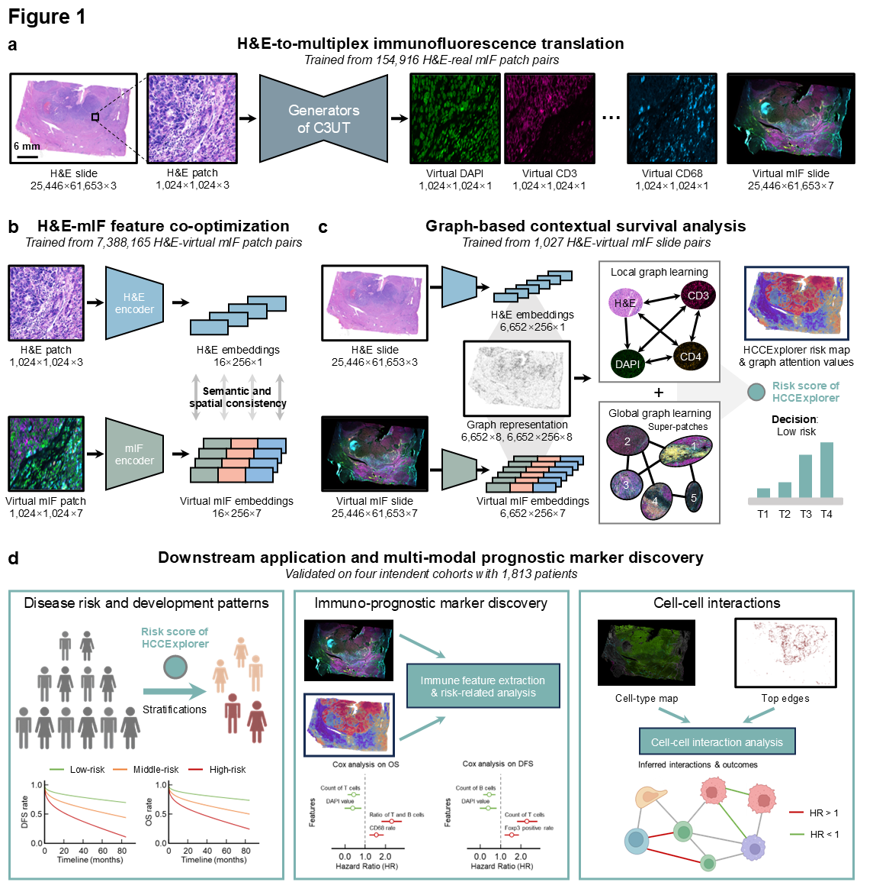

# HCCExplorer: Transforming Histology into Virtual Multiplex Immunofluorescence to Decode Tumor Immune Microenvironment in Hepatocellular Carcinoma

[](LICENSE)
[](https://www.python.org/)

This repository contains the official implementation of **HCCExplorer**, a deep learning framework that transforms standard H&E slides into virtual multiplex immunofluorescence (mIF) images and performs spatially resolved survival analysis for hepatocellular carcinoma (HCC). ** Specific tutorials are in directories.**

## 🔬 Overview

<p align="center">
  <a href="./Figures/Figure1.png">
    
  </a>
  <br>
  <b>Figure 1</b>: HCCExplorer framework overview. 
  <a href="./Figures/Figure1.png">[View Full PNG]</a>
</p>


## 🌟 Key Features

| Module             | Description                                                  | Status      |
| ------------------ | ------------------------------------------------------------ | ----------- |
| **C3UT**           | Cell-Consistent Cross-modal Unpaired Translation for H&E-to-virtual mIF generation | ✅ |
| **CellFilter**     | Quality control pipeline for H&E and mIF cell segmentation   | ✅ |
| **CoOptimization** | Multi-modal contrastive learning for H&E-virtual mIF feature alignment | ✅ |
| **GraphLearning**  | Graph-based contextual survival prediction with interpretable attention | ✅ |
| **ImmuneAnalysis** | Spatial immune feature extraction and prognostic biomarker discovery | ✅ |
| **Registration**   | Whole-slide image registration and patch alignment           | ✅ |


## 🔬 Overview

HCCExplorer addresses critical limitations in routine hepatopathology by:

1. **Virtual Immunophenotyping**: Generates high-fidelity virtual mIF images (CD3, CD4, CD8, CD19, CD68, Foxp3, DAPI) from standard H&E slides without physical staining
2. **Spatial Prognostic Modeling**: Captures tumor-immune microenvironment (TIME) interactions through hierarchical graph learning
3. **Biomarker Discovery**: Identifies macrophage-mediated "Containment Niche" as a protective spatial signature at the invasion frontier

### Performance Highlights

- **C-index**: 0.71 (95% CI: 0.67–0.76) for overall survival prediction
- **Data Efficiency**: Trained on only 30 paired slides, generalized to 1,813 patients across 4 centers
- **Superior Generalization**: Outperforms pathology foundation models (UNI-h2, CHIEF, Prov-GigaPath, TITAN) and proteomics foundation model (KRONOS)


## 📁 Repository Structure

```text
HCCExplorer/
├── C3UT/                    # Virtual mIF translation (Cell-Consistent Cross-modal Unpaired Translation)
    └── Tutorial             # Step-by-step guide for H&E-to-mIF generation
├── CellFilter               # Cell segmentation and quality control
    └── Tutorial             # Data preprocessing and cell filtering protocols
├── CoOptimization/          # H&E-virtual mIF feature co-optimization
    └── Tutorial             # Multi-modal contrastive learning pipeline
├── GraphLearning/           # Graph-based survival analysis
    └── Tutorial             # Graph construction and survival prediction
├── ImmuneAnalysis/          # Spatial immune feature extraction
    └── Tutorial             # Immune profiling and biomarker validation
└── Registration/            # WSI registration and spatial alignment
    └── Tutorial             # Image registration workflows
```

> **Note**: Each module contains a dedicated `Tutorial/` folder with detailed documentation, usage examples, and step-by-step instructions.


## 🚀 Quick Start

### Prerequisites

```bash
# Python 3.8+
pip install torch>=1.12.0 torchvision>=0.13.0
pip install openslide-python numpy pandas scikit-learn
pip install torch-geometric torch-scatter torch-sparse  # For GraphLearning
```

### 1. Virtual mIF Generation (C3UT)

📖 **Detailed tutorial**: See `C3UT/Tutorial`

### 2. Feature Co-Optimization

📖 **Detailed tutorial**: See `CoOptimization/Tutorial`

### 3. Survival Prediction (GraphLearning)

📖 **Detailed tutorial**: See `GraphLearning/Tutorial`

### 4. Immune Feature Analysis

📖 **Detailed tutorial**: See `ImmuneAnalysis/Tutorial`


## 📊 Datasets

The framework was validated on four independent cohorts:

| Cohort     | Institution                                     | Patients | Slides | Usage               |
| :--------- | :---------------------------------------------- | :------- | :----- | :------------------ |
| FAZJU      | First Affiliated Hospital, Zhejiang University  | 949      | 1,017  | Training            |
| FAZJU-Test | Internal test set                               | 237      | 237    | Internal validation |
| SAZJU      | Second Affiliated Hospital, Zhejiang University | 211      | 211    | External validation |
| TCGA-LIHC  | The Cancer Genome Atlas                         | 342      | 342    | External validation |
| YWCH       | Yiwu Central Hospital                           | 74       | 74     | External validation |


## 🔍 Key Biological Findings

HCCExplorer enabled discovery of:

1. **Macrophage Infiltration**: Most significant protective factor (HR=0.51, P<0.001)
2. **M1 Polarization**: Pro-inflammatory macrophages drive survival benefit (HR=0.40, P<0.05)
3. **Containment Niche**: Macrophage-orchestrated immune barrier at invasion frontier (P<0.01)
4. **Spatial Co-localization**: Foxp3+ Tregs and CD4+ T cells cooperate with macrophages at tumor boundary


## 🛠️ Installation

```bash
# Clone repository
git clone https://github.com/MedCAI/HCCExplorer.git
cd HCCExplorer

# Install dependencies in each directory
pip install -r requirements.txt

# Download pretrained weights (available upon request for academic use)
```


## 📚 Citation

If you use HCCExplorer in your research, please cite:

```bibtex
@article{cai2026hccexplorer,
  title={Transforming Histology into Virtual Multiplex Immunofluorescence to Decode Prognostic Spatial Immunity in Hepatocellular Carcinoma},
  author={Cai, Linghan and Jiang, Songhan and Liang, Junhao and Liu, Fengchun and Zhang, Buyi and Reitsam, Nic Gabriel and Zeng, Qinghe and Hu, Zheqi and Ma, Yanqing and Li, Ziqian and Shi, Feng and Hu, Maotong and Zhang, Xiuming and Zhang, Jing and Kather, Jakob Nikolas and Zhang, Yongbing and Liang, Wenjie},
  journal={arXiv},
  year={2026}
}
```


## 📧 Contact

For questions about the code or model access:

- **Issues**: Please use [GitHub Issues](https://github.com/MedCAI/HCCExplorer/issues)
- **Email**: [Linghan Cai](cailh@stu.hit.edu.cn); [Songhan Jiang](jsh1299033562@163.com); [Fengchun Liu](2481857079@qq.com)


## 🤝 Contributing
Thanks to the following work for improving our project：
- MADELEINE (contrastive learning): https://github.com/mahmoodlab/MADELEINE
- Trident (data pre-processing): https://github.com/mahmoodlab/TRIDENT
- HoverNet (cell segmentation): https://github.com/vqdang/hover_net
- VALIS (WSI registration): https://github.com/MathOnco/valis
- TEA-Graph (graph learning): https://github.com/taliq/TEA-graph
- CUT (H&E-to-mIF translation): https://github.com/taesungp/contrastive-unpaired-translation/
- TissueLab (code style): https://github.com/zhihuanglab/Tissuelab-Model-Zoo/tree/main

## 📜 License

This code is made available for **academic research purposes only**. Commercial use requires explicit permission from the authors.

