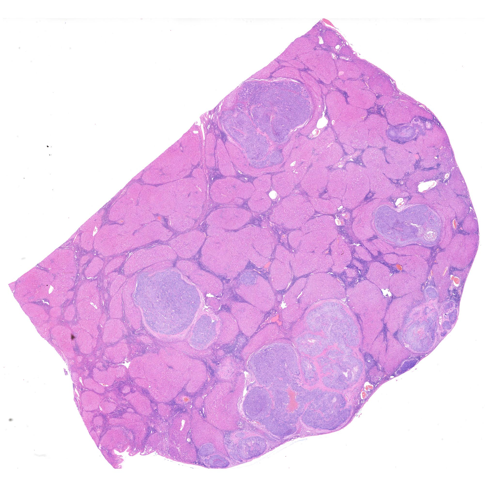
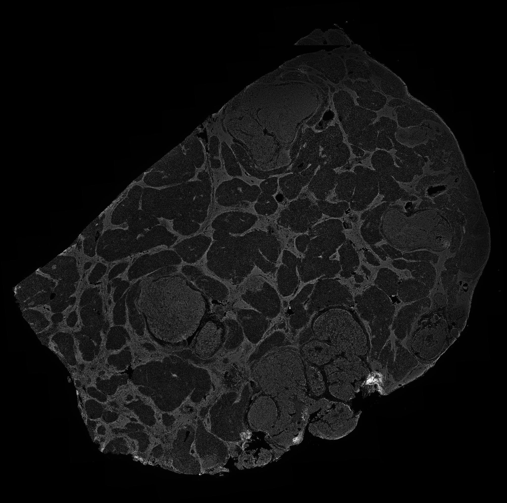
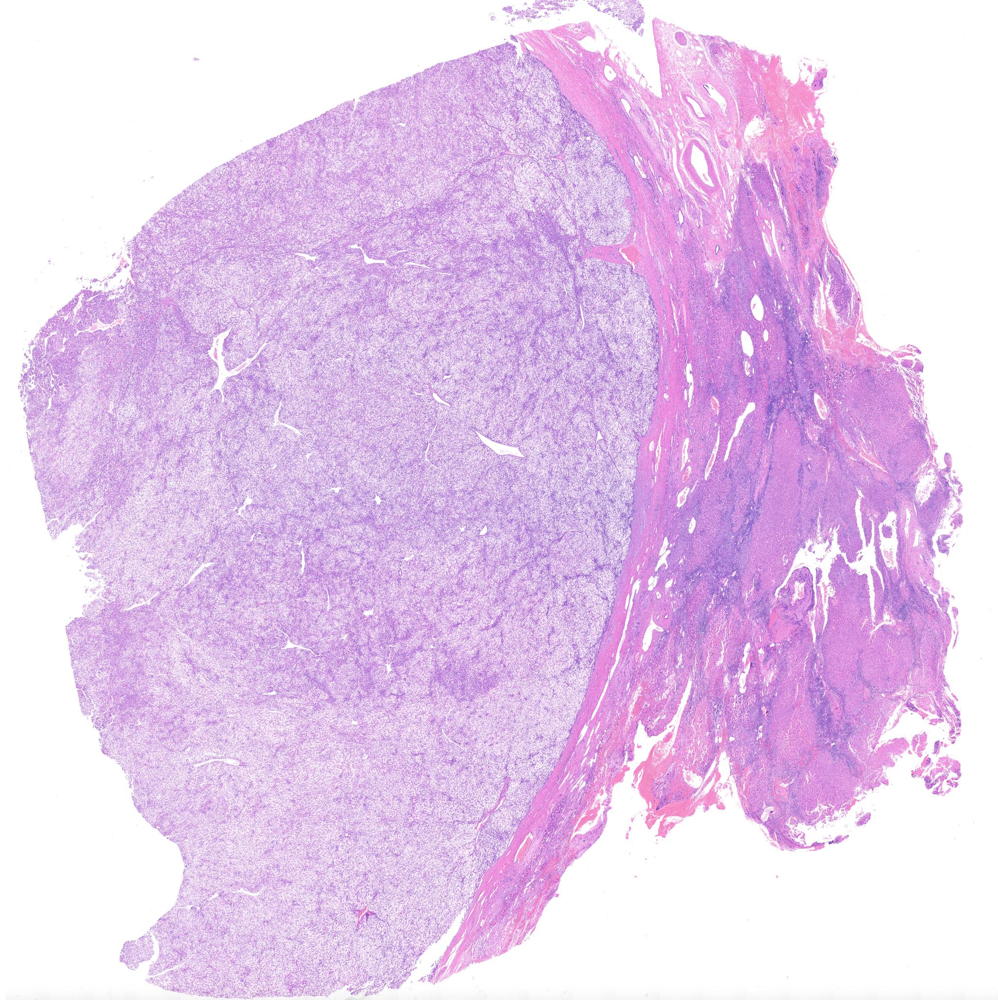
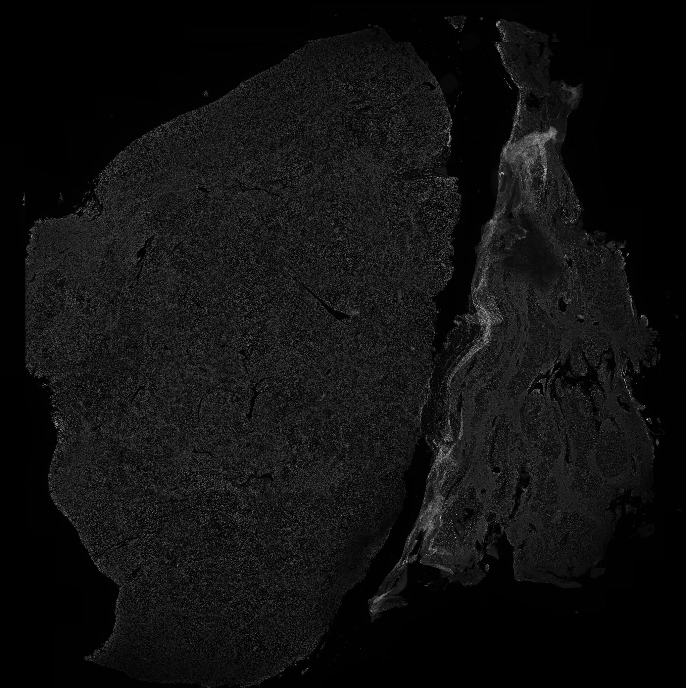

# Image Registration Module

This module handles the registration of Whole Slide Images (WSIs), specifically focusing on aligning H&E (Hematoxylin and Eosin) slides with Multiplex Immunofluorescence (mIF) scans. 

The pipeline utilizes the **VALIS** library to perform both rigid and non-rigid transformations, ensuring pixel-level alignment across different staining modalities.

## 📂 File Structure

| File / Directory                  | Description                                                  |
| :-------------------------------- | :----------------------------------------------------------- |
| **`Tutorial_registration.ipynb`** | 📖 **Start Here:** A Jupyter Notebook demonstrating the step-by-step registration workflow. |
| `base_registration.py`            | Core logic for initial rigid alignment (affine transformations). |
| `fine_registration.py`            | Advanced logic for non-rigid registration and fine-tuning.   |
| `generate_thumbnails.py`          | Utility script to generate preview thumbnails from large WSIs. |
| `save_images.py`                  | Helper script to save registered outputs.                    |
| `save_images_linux.py`            | Linux-specific optimization for saving images.               |
| `deal_HE/`                        | Directory containing H&E slide processing data.              |
| `deal_IF/`                        | Directory containing Immunofluorescence slide processing data. |

## 🖼️ Registration Examples

Below are examples of the H&E and mIF pairs being processed. The goal of this pipeline is to spatially align these modalities for downstream analysis.

|     Case ID     |                       H&E (Reference)                        |                         mIF (Moving)                         |
| :-------------: | :----------------------------------------------------------: | :----------------------------------------------------------: |
| **201403500.6** |  |  |
| **201418604.2** |  |  |

## 🛠️ Dependencies

This project relies on the following key libraries:

- **[VALIS](https://github.com/MathOnco/valis)** (Virtual Alignment of pathology Image Series)
- `pyvips`
- `numpy`
- `os`, `time`

## 📜 Citation & Acknowledgements

This registration pipeline is built upon the **VALIS** library. If you use this code or the VALIS library in your research, please cite the original paper:

> **VALIS: Virtual alignment of pathology image series for multi-gigapixel whole slide images** > Chandler D. Gatenbee, Alexander R. A. Anderson, et al.  
> *GitHub Repository:* [https://github.com/MathOnco/valis](https://github.com/MathOnco/valis)